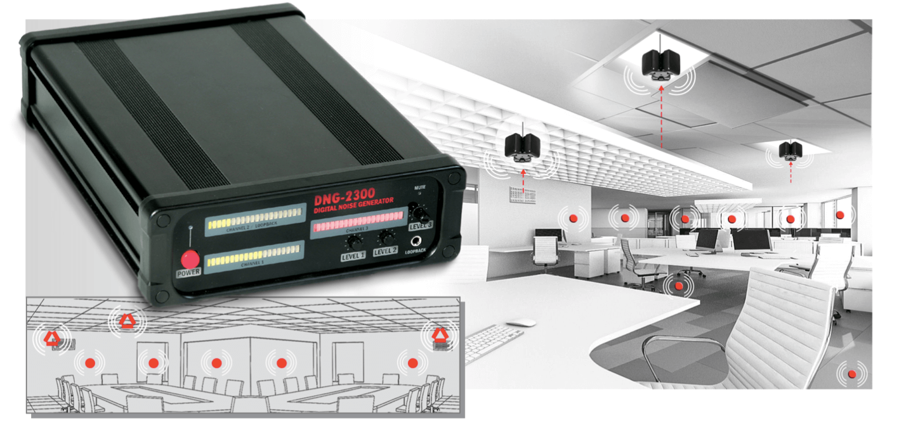

# Privacy Shield

## Description

Privacy Shield is an IoT hardware ecosystem designed to be attached to doors, windows, and other surfaces to mask ambient room noise. The primary objective is to obfuscate private conversations and activities inside a room, preventing eavesdropping or disturbance from the outside.

Each device is **autonomous** — it captures ambient sound via a MEMS microphone, detects speech using Voice Activity Detection (VAD), and dynamically emits an optimized masking signal (Pink or Brown noise) through a surface-mounted transducer. There is no Master/Slave hierarchy. Every device makes its own masking decisions.

Devices communicate over a **decentralized ESP-NOW mesh** for awareness and coordination, but each device can operate independently.

An optional **Hub** (a standard ESP32-S3) can be added to the mesh for monitoring and control. The Hub runs a Web dashboard accessible from any browser on the same WiFi network — no app installation required.

**No cloud dependency.** No MQTT. No internet needed.

---

## Architecture

```
┌──────────────────────────────────────────────┐
│               Home WiFi                      │
│                                              │
│  ┌─────────────────┐   ┌──────────────────┐  │
│  │  Tablet / Phone │   │  Laptop          │  │
│  │  (Chrome → Hub) │   │  (Chrome → Hub)  │  │
│  └────────┬────────┘   └────────┬─────────┘  │
│           │                     │            │
│           └──────────┬──────────┘            │
│                      │ WiFi                  │
│                ┌─────▼──────┐                │
│                │  ESP32 Hub │  ← Optional    │
│                │ (optional) │                │
│                └─────┬──────┘                │
└──────────────────────┼───────────────────────┘
                       │ ESP-NOW
    ┌──────────────────┼──────────────────┐
    │                  │                  │
 ┌──▼──┐           ┌───▼───┐          ┌───▼───┐
 │Node1│           │Node2  │          │Node3  │
 │     │           │       │          │       │
 │Mic  │           │Mic    │          │Mic    │
 │Amp  │           │Amp    │          │Amp    │
 │DAEX │           │DAEX   │          │DAEX   │
 └─────┘           └───────┘          └───────┘
```

- **Masking Nodes:** ESP32-S3 + I2S mic + MAX98357A + DAEX25. ESP-NOW only. Zero setup.
- **Hub (optional):** Same ESP32-S3. Runs WiFi + ESP-NOW simultaneously. Serves a Web dashboard.
- **Control interface:** Open Chrome, navigate to the Hub's IP, full dashboard loads. No app required.

### Key Design Decisions

| Decision | Why |
|---|---|
| **Decentralized mesh** | No single point of failure. Each node masks independently. No Master election overhead. |
| **ESP-NOW** | Low-latency, no pairing, no WiFi router needed for mesh. |
| **Hub over WiFi** | No app development. Works on any device with a browser (phone, tablet, laptop). |
| **No cloud** | No privacy leak. No MQTT broker to manage. No internet dependency. |

---

## Development Roadmap

We have structured the development into four iterative sprints:

### Sprint 1 — Hardware Bring-up & Basic Mesh

**Goal:** Two devices powered on, capturing audio, playing audio, and talking over ESP-NOW.

- Development environment (ESP-IDF, FreeRTOS)
- I2S microphone driver — raw audio capture
- MAX98357A + DAEX25 driver — play tones and noise
- ESP-NOW basic communication
- Node discovery (broadcast HELLO, maintain neighbor list)
- Mechanical isolation testing (minimize transducer vibration reaching the mic)

### Sprint 2 — Audio Pipeline & Adaptive Masking

**Goal:** Each device detects speech and emits adaptive Pink/Brown noise independently.

- Double-buffered I2S capture (DMA ping-pong buffers)
- Voice Activity Detection (VAD) — energy-based + spectral
- Pink/Brown noise generation
- Adaptive Masking Algorithm — scale output proportionally to input speech
- Autonomous operation (each node masks based on its own mic)
- Real-room testing and parameter tuning

### Sprint 3 — Acoustic Echo Cancellation

**Goal:** Eliminate feedback loops where the microphone hears its own transducer output.

- NLMS (Normalized Least Mean Squares) adaptive filter
- Echo path estimation (transducer → surface → air → mic)
- Double-talk detection (Geigel algorithm)
- Integration: Mic → AEC → VAD → Masking
- Long-duration stability testing (2h+ continuous)

### Sprint 4 — Hub Dashboard & Hardware Finalization

**Goal:** Full control interface + 3D-printed enclosure.

- Hub firmware (WiFi softAP + ESP-NOW simultaneous)
- REST API (`GET /api/nodes`, `POST /api/node/{id}/mute`, etc.)
- Web dashboard (HTML/CSS/JS, served from Hub's SPIFFS)
- Control features: mute per node, global mute, volume control, battery stats
- 3D-printed enclosure design with mic/transducer isolation chambers
- Full system assembly and long-duration test

---

## Technical Stack

| Component | Technology |
|---|---|
| **Microcontroller** | ESP32-S3 (8MB PSRAM) |
| **Operating System** | FreeRTOS (ESP-IDF) |
| **Mesh Protocol** | ESP-NOW |
| **Microphone Interface** | I2S (MEMS) |
| **Amplifier Interface** | I2S (MAX98357A) |
| **Hub Dashboard** | HTTP + REST API (served from ESP32) |
| **Hub WiFi** | SoftAP + Station mode (coexistence with ESP-NOW) |

---

## Hardware Components

### Per Masking Node

| Component | Qty | Notes |
|---|---|---|
| ESP32-S3 (8MB PSRAM) | 1 | Recommended for audio buffering |
| I2S MEMS Microphone | 1 | |
| Dayton Audio DAEX25 Sound Exciter (Transducer) | 1 | [Link](https://amzn.eu/d/07JOvqCm) |
| MAX98357A Class-D Amplifier | 1 | [Link](https://amzn.eu/d/0508CoDR) |
| 18650 Battery | 2 | |
| 18650 Battery Shield V3 | 1 | [Link](https://amzn.eu/d/0iAi3bPU) |
| Breadboard & connectors | 1 | |
| 22 AWG Speaker Wire | | [Link](https://amzn.eu/d/0dPKMZ0M) |

### Per Hub (optional)

| Component | Qty | Notes |
|---|---|---|
| ESP32-S3 (8MB PSRAM) | 1 | No audio hardware needed |

---

## Inspiration & Related Work

### DNG-2300

The DNG-2300 generator is a commercial unit created to protect against listening devices that cannot be discovered by common methods. The unit protects a room by inducing non-filterable noise onto surfaces using TRN-2000 transducers and OMS-2000 speakers.



---

For a detailed breakdown of each sprint task, see [SPRINT_PLAN.md](SPRINT_PLAN.md).

## Project Structure
```text
privacy-shield/
│
├── CMakeLists.txt              # Global build configuration
├── sdkconfig.defaults          # Here we force 8MB PSRAM and ESP32-S3 configs
│
├── main/
│   ├── CMakeLists.txt          # Tells the compiler which components to load in main
│   ├── main.c                  # The entry point (app_main)
│   └── include/
│       └── global_config.h     # Pins defined here (e.g., PIN_I2S_BCLK, PIN_AMP_DOUT)
│
└── components/
    │
    ├── audio_hal/              # (Hardware Abstraction Layer)
    │   ├── CMakeLists.txt
    │   ├── include/audio_hal.h
    │   ├── i2s_mic.c           # Task 1.2: I2S driver to capture audio
    │   └── max_amp.c           # Task 1.3: Driver for the DAEX25 transducer
    │
    ├── mesh_core/              
    │   ├── CMakeLists.txt
    │   ├── include/mesh_core.h
    │   ├── esp_now_link.c      # Task 1.4: Basic ESP-NOW communication
    │   └── node_discovery.c    # Task 1.5: Neighbor list management
    │
    ├── dsp_engine/             
    │   ├── CMakeLists.txt
    │   ├── include/dsp_engine.h
    │   ├── vad.c               # Sprint 2: Voice Activity Detection (VAD)
    │   ├── noise_gen.c         # Sprint 2: Pink/Brown noise generation
    │   └── aec_filter.c        # Sprint 3: Acoustic echo cancellation
    │
    └── web_dashboard/          # Sprint 4: Prepared for the Hub node
        ├── CMakeLists.txt
        ├── include/web_dashboard.h
        ├── web_server.c        
        └── web_api.c


